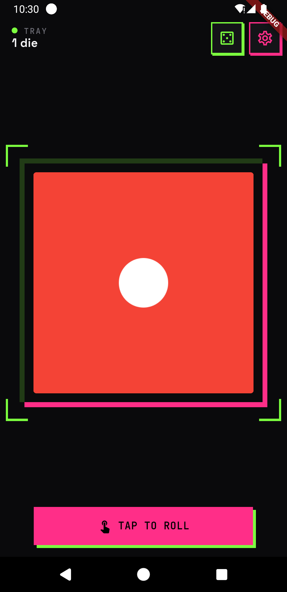
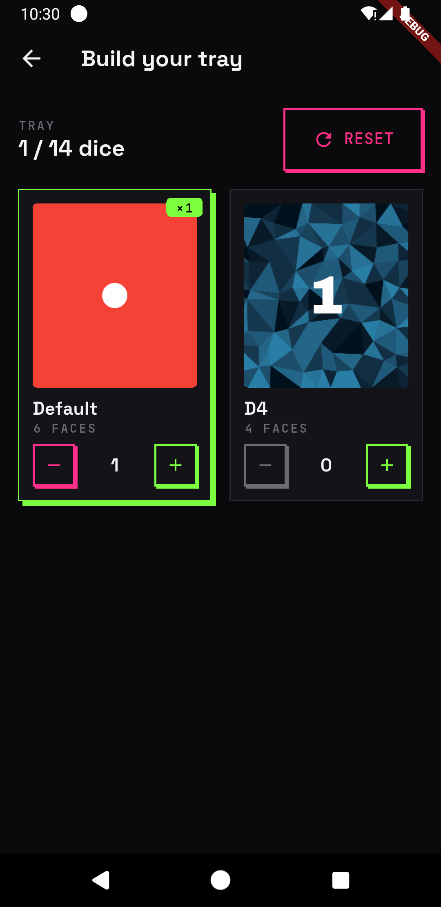
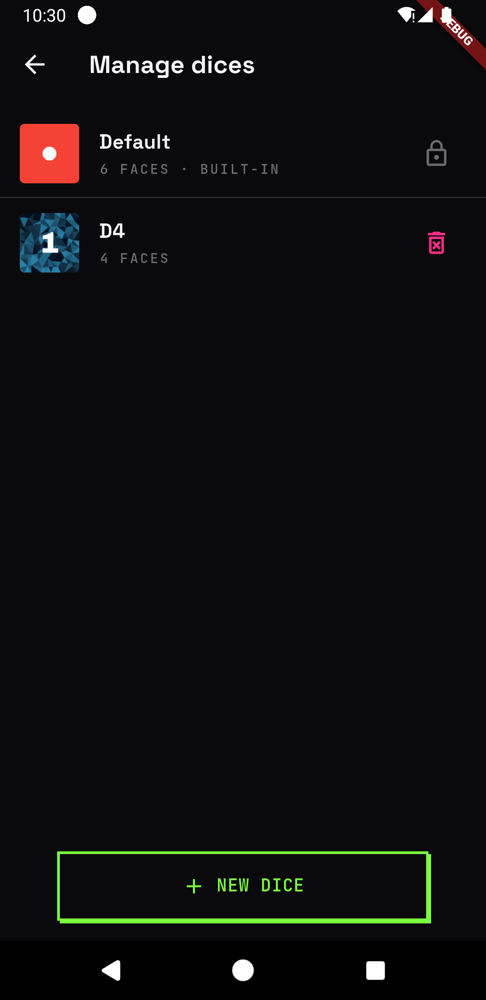
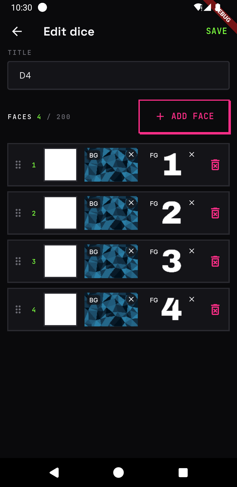

# Dice Roll

Dice Roll is a fast, customizable dice roller. Roll a whole tray of dice at once, lock the ones you want to keep, and build your own dice with custom faces, colours, and images. It works fully offline, has no ads, and is free and open source.

## Screens

### Home
The main roll surface, laid out as a tray of one or more dice. Tap any die — or the **Tap to Roll** button — to roll every unlocked die at once, each with its own animated face-swap. **Long-press a die to lock it**: locked dice keep their value, are skipped on the next roll, and are marked with a lock badge. The tray automatically uses as many dice as comfortably fit your screen, and that count stays stable when you rotate the device so no dice are ever dropped. The app bar shows a summary of the current tray plus quick access to the dice selector and dice management.

### Select dice(s)
Build your tray here. Each available dice has a quantity stepper — tap **+** / **−** to add or remove copies — while the header shows how many dice are selected against how many will fit on the roll screen. Adding is capped at that limit, and a **Reset** button clears everything back to a single default die.

### Manage dices
A list of every dice you can use: the built-in default plus any custom dice you've created. Tap a custom dice to open it in the editor, or remove it with a confirmation prompt. The built-in dice is locked so it can't be edited or deleted. Use the **New dice** button to start a fresh one.

### Create or edit dices
Design a custom dice from scratch or tweak an existing one. Give it a name, then add, remove, and reorder its faces. Every face can have its own background colour, an optional background image, and a foreground image. The editor validates your dice — a non-empty, unique name and a valid number of faces — before saving it to your collection.

### Support free apps! 
If you like it, please consider buying me a coffee.

